# HawkWatch Platform - Design Document

## 1. System Architecture

### 1.1 High-Level Architecture

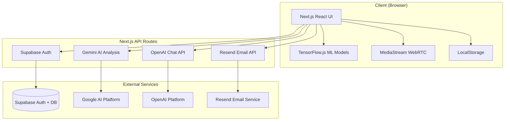

### 1.2 Application Flow

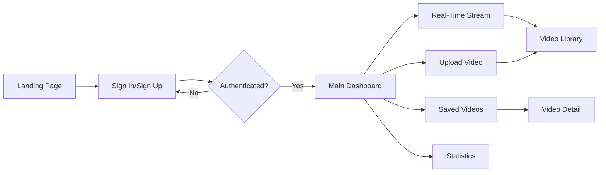


---

## 2. Real-Time Stream Processing Flow

### 2.1 Real-Time Analysis Pipeline

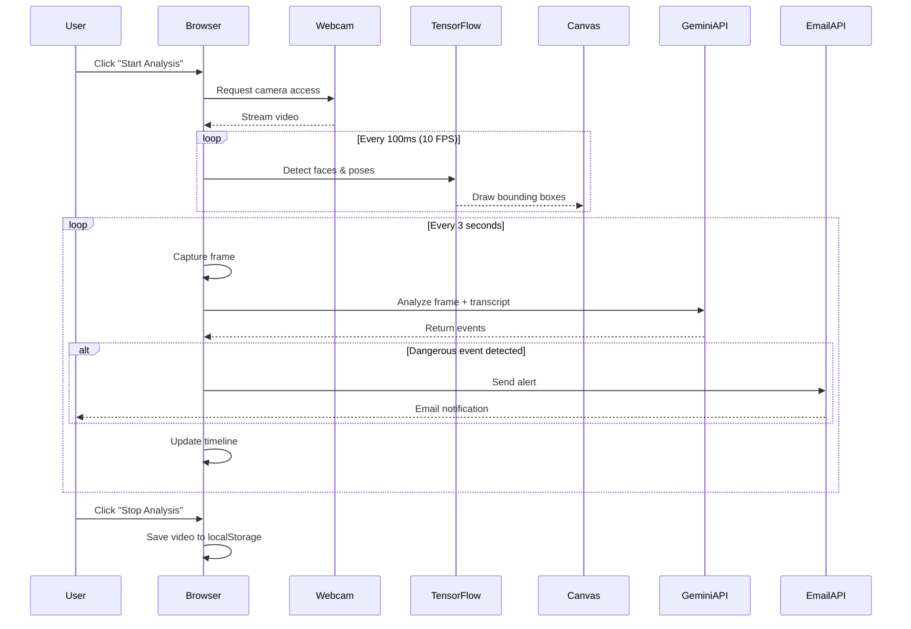

### 2.2 Video Upload Processing Flow

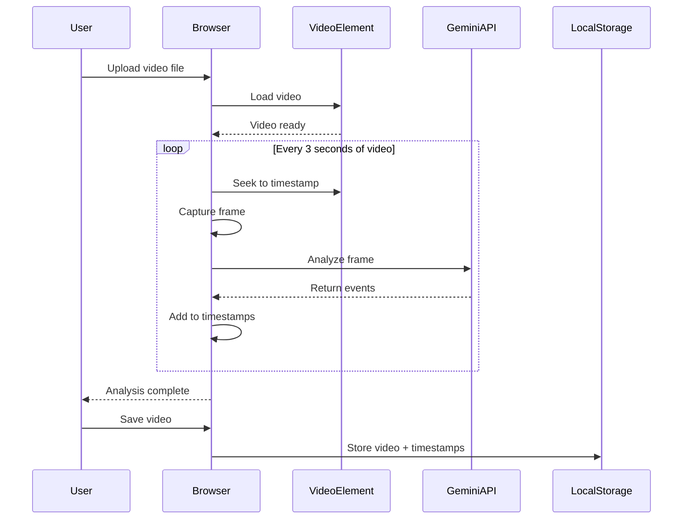

---

## 3. Component Architecture

### 3.1 Page Components Structure

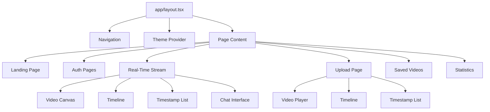


### 3.2 Key Component Details

#### 3.2.1 Real-Time Stream Page
**File:** `app/pages/realtimeStreamPage/page.tsx`

**State Management:**
```typescript
// Recording state
isRecording: boolean
timestamps: Timestamp[]
transcript: string
videoName: string
recordedVideoUrl: string | null

// ML Models state
mlModelsReady: boolean
isInitializing: boolean
initializationProgress: string

// Video state
currentTime: number
videoDuration: number

// UI state
error: string | null
analysisProgress: number
```

**Key Functions:**
- `initMLModels()`: Load TensorFlow.js models (BlazeFace, MoveNet)
- `startWebcam()`: Request camera access and initialize stream
- `runDetection()`: Real-time face/pose detection loop (10 FPS)
- `analyzeFrame()`: Send frame to Gemini API every 3 seconds
- `startRecording()`: Begin video recording and analysis
- `stopRecording()`: Stop all processes and save video
- `handleSaveVideo()`: Save to localStorage

#### 3.2.2 Upload Page
**File:** `app/pages/upload/page.tsx`

**State Management:**
```typescript
videoUrl: string
isUploading: boolean
isAnalyzing: boolean
timestamps: Timestamp[]
uploadProgress: number
videoName: string
```

**Key Functions:**
- `handleFileUpload()`: Process uploaded video file
- `captureFrame()`: Extract frame at specific timestamp
- `handleTimestampClick()`: Seek video to timestamp
- `handleSaveVideo()`: Save to localStorage

#### 3.2.3 Saved Videos Page
**File:** `app/pages/saved-videos/page.tsx`

**State Management:**
```typescript
savedVideos: SavedVideo[]
searchTerm: string
filteredVideos: SavedVideo[]
```

**Key Functions:**
- `handleDelete()`: Remove video from localStorage
- Search filtering by name and event description

---

## 4. Data Models

### 4.1 Core Interfaces

```typescript
interface Timestamp {
  timestamp: string;        // Format: "MM:SS"
  description: string;      // Event description
  isDangerous: boolean;     // Danger classification
}

interface SavedVideo {
  id: string;               // Unique identifier (timestamp)
  name: string;             // User-assigned name
  url: string;              // Blob URL or remote URL
  thumbnailUrl: string;     // Video thumbnail
  timestamps: Timestamp[];  // Detected events
}

interface VideoEvent {
  description: string;      // Event description from AI
  isDangerous: boolean;     // Danger flag
  timestamp?: string;       // Optional timestamp
}
```

### 4.2 Data Flow Diagram

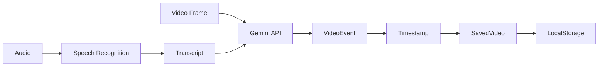

---

## 5. AI/ML Integration

### 5.1 TensorFlow.js Models

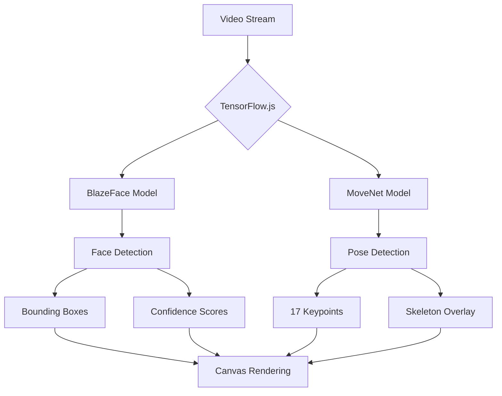

**BlazeFace Configuration:**
```typescript
{
  maxFaces: 1,
  scoreThreshold: 0.5,
  iouThreshold: 0.3
}
```

**MoveNet Configuration:**
```typescript
{
  modelType: SINGLEPOSE_LIGHTNING,
  enableSmoothing: true,
  minPoseScore: 0.3
}
```

### 5.2 Gemini AI Analysis

**Model:** `gemini-2.5-flash`

**Prompt Structure:**
```
Analyze this frame and determine if any dangerous situations are occurring:

1. Medical Emergencies (unconscious, choking, seizures)
2. Falls and Injuries
3. Distress Signals
4. Violence or Threats
5. Suspicious Activities (shoplifting, vandalism)

[Optional: Audio transcript context]

Return JSON: { events: [{ timestamp, description, isDangerous }] }
```

**Response Processing:**
1. Extract JSON from response (handle code blocks)
2. Parse events array
3. Filter dangerous events
4. Trigger email notifications if needed

---

## 6. API Routes Design

### 6.1 API Endpoints

```mermaid
graph LR
    A[Client] --> B[/api/chat]
    A --> C[/api/send-email]
    A --> D[/api/analyze]
    A --> E[/api/upload]
    A --> F[/api/summary]
    
    B --> G[OpenAI]
    C --> H[Resend]
    D --> I[Gemini]
    E --> J[Vercel Blob]
    F --> I
```


### 6.2 Server Actions

#### 6.2.1 detectEvents (Real-Time Stream)
**File:** `app/pages/realtimeStreamPage/actions.ts`

```typescript
async function detectEvents(
  base64Image: string, 
  transcript: string = ''
): Promise<{ events: VideoEvent[], rawResponse: string }>
```

**Process:**
1. Validate base64 image data
2. Initialize Gemini model
3. Send image + transcript to API
4. Parse JSON response (handle code blocks)
5. Return events array

#### 6.2.2 detectEvents (Upload)
**File:** `app/pages/upload/actions.ts`

```typescript
async function detectEvents(
  base64Image: string
): Promise<{ events: VideoEvent[], rawResponse: string }>
```

**Process:** Same as real-time, but without transcript

#### 6.2.3 Chat API
**File:** `app/api/chat/route.ts`

```typescript
POST /api/chat
Body: { messages: Message[], events: Timestamp[] }
Response: { content: string, role: 'assistant' }
```

**Process:**
1. Build context from recent events
2. Send to OpenAI GPT-3.5 Turbo
3. Return assistant response

#### 6.2.4 Email API
**File:** `app/api/send-email/route.ts`

```typescript
POST /api/send-email
Body: { title: string, description: string }
Response: { data: EmailResponse } | { error: string }
```

**Process:**
1. Validate RESEND_API_KEY
2. Send email via Resend API
3. Return success/error

---

## 7. UI Components

### 7.1 Reusable Components

#### 7.1.1 Timeline Component
**File:** `app/components/Timeline.tsx`

**Props:**
```typescript
interface TimelineProps {
  events: {
    startTime: number;
    endTime: number;
    type: 'normal' | 'warning';
    label: string;
  }[];
  totalDuration: number;
  currentTime?: number;
}
```

**Features:**
- Visual timeline with event markers
- Color-coded events (red = dangerous, blue = normal)
- Hover tooltips with event details
- Current time indicator
- Time markers every ~5 seconds

#### 7.1.2 Timestamp List Component
**File:** `components/timestamp-list.tsx`

**Props:**
```typescript
interface TimestampListProps {
  timestamps: Timestamp[];
  onTimestampClick: (timestamp: string) => void;
}
```

**Features:**
- List of all detected events
- Click to seek video
- Expandable descriptions
- Color-coded by danger level
- Safe/Dangerous legend

#### 7.1.3 Chat Interface Component
**File:** `components/chat-interface.tsx`

**Props:**
```typescript
interface ChatInterfaceProps {
  timestamps: Timestamp[];
  className?: string;
}
```

**Features:**
- Floating chat button
- Expandable chat window
- Message history
- Context-aware responses
- Loading states

#### 7.1.4 Video Player Component
**File:** `components/video-player.tsx`

**Props:**
```typescript
interface VideoPlayerProps {
  url: string;
  timestamps: Timestamp[];
}
```

**Features:**
- Custom video controls
- Timeline integration
- Timestamp markers
- Seek functionality

---

## 8. State Management Strategy

### 8.1 Client-Side State

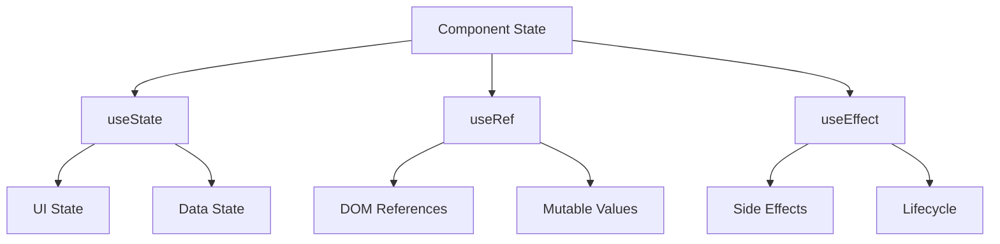

**State Categories:**

1. **UI State** (useState)
   - Loading indicators
   - Error messages
   - Modal visibility
   - Form inputs

2. **Data State** (useState)
   - Timestamps array
   - Video metadata
   - User preferences

3. **Refs** (useRef)
   - Video element
   - Canvas element
   - MediaStream
   - ML models
   - Intervals/timeouts

4. **Side Effects** (useEffect)
   - Model initialization
   - Webcam setup
   - Event listeners
   - Cleanup

### 8.2 LocalStorage Schema

```typescript
// Key: "savedVideos"
// Value: SavedVideo[]
[
  {
    id: "1707580800000",
    name: "Store Monitoring - Feb 10",
    url: "blob:http://localhost:3000/...",
    thumbnailUrl: "blob:http://localhost:3000/...",
    timestamps: [
      {
        timestamp: "00:15",
        description: "Person entering store",
        isDangerous: false
      },
      {
        timestamp: "02:30",
        description: "Suspicious behavior detected",
        isDangerous: true
      }
    ]
  }
]
```

---

## 9. Performance Optimization

### 9.1 Real-Time Processing Optimizations

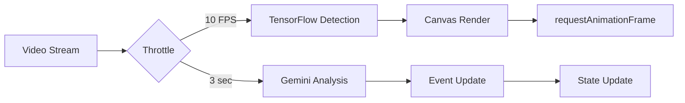

**Optimization Strategies:**

1. **Frame Rate Throttling**
   - TensorFlow detection: 10 FPS (100ms interval)
   - Gemini analysis: Every 3 seconds
   - Canvas rendering: requestAnimationFrame

2. **Model Configuration**
   - BlazeFace: maxFaces=1, scoreThreshold=0.5
   - MoveNet: SINGLEPOSE_LIGHTNING (faster variant)
   - Enable smoothing for better performance

3. **Video Resolution**
   - Fixed 640x360 (16:9 aspect ratio)
   - Reduces processing overhead
   - Maintains quality for detection

4. **Memory Management**
   - Cleanup intervals on unmount
   - Cancel animation frames
   - Revoke blob URLs
   - Clear event listeners

### 9.2 Bundle Optimization

**Code Splitting:**
- TensorFlow.js loaded dynamically
- Models loaded on-demand
- Route-based code splitting (Next.js automatic)

**Asset Optimization:**
- Image optimization (Next.js Image component)
- CSS purging (Tailwind)
- Tree shaking (unused code removal)

---

## 10. Error Handling

### 10.1 Error Handling Flow

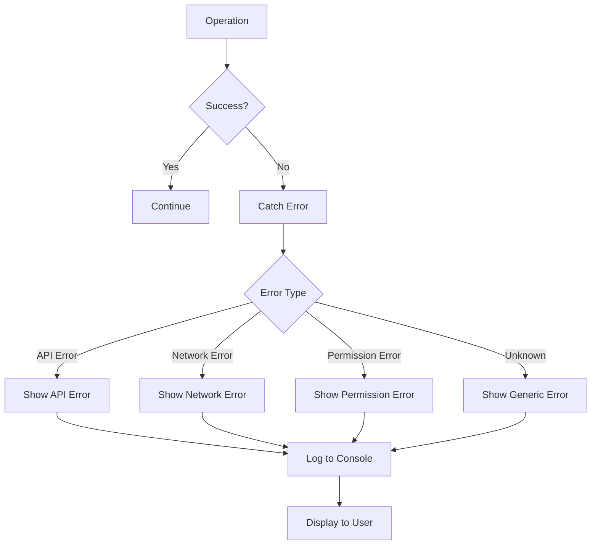


### 10.2 Error Scenarios

**1. Webcam Access Denied**
```typescript
try {
  const stream = await navigator.mediaDevices.getUserMedia({...})
} catch (error) {
  setError("Failed to access webcam. Please grant camera permissions.")
}
```

**2. ML Model Loading Failure**
```typescript
try {
  const model = await blazeface.load()
} catch (error) {
  setError("Failed to load ML models: " + error.message)
  setMlModelsReady(false)
}
```

**3. API Rate Limiting**
```typescript
// Gemini API: Throttle to 3-second intervals
// OpenAI API: Handle 429 errors gracefully
// Resend API: Queue emails if rate limited
```

**4. Email Service Errors**
```typescript
if (!process.env.RESEND_API_KEY) {
  return NextResponse.json(
    { error: 'Email service not configured' }, 
    { status: 500 }
  )
}
```

**5. LocalStorage Quota Exceeded**
```typescript
try {
  localStorage.setItem("savedVideos", JSON.stringify(videos))
} catch (error) {
  alert("Storage quota exceeded. Please delete old videos.")
}
```

---

## 11. Security Considerations

### 11.1 Security Architecture

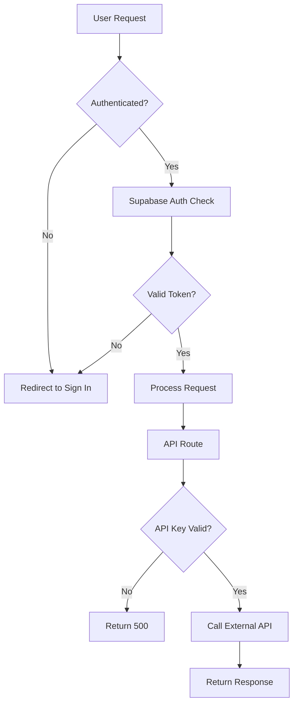

### 11.2 Security Measures

**1. Authentication**
- Supabase Auth for user management
- JWT tokens for session management
- Protected routes require authentication

**2. API Key Protection**
- Environment variables for all API keys
- Server-side API calls only
- Never expose keys to client

**3. Data Privacy**
- Client-side video processing (no upload to server)
- LocalStorage for video storage (user's browser)
- No persistent server-side video storage

**4. Input Validation**
- Validate base64 image format
- Sanitize user inputs
- Type checking with TypeScript

**5. CORS & CSP**
- Next.js default security headers
- Restrict API access to same origin
- Content Security Policy headers

---

## 12. Deployment Architecture

### 12.1 Deployment Flow

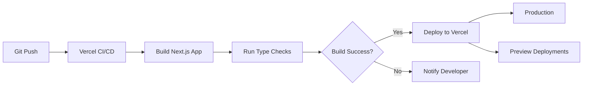

### 12.2 Environment Configuration

**Required Environment Variables:**
```bash
# Google AI
GOOGLE_API_KEY=your_gemini_api_key

# OpenAI
OPENAI_API_KEY=your_openai_api_key

# Supabase
NEXT_PUBLIC_SUPABASE_URL=your_supabase_url
NEXT_PUBLIC_SUPABASE_ANON_KEY=your_supabase_anon_key

# Resend
RESEND_API_KEY=your_resend_api_key

# Vercel (optional)
VERCEL_URL=auto_generated
```

**Deployment Checklist:**
- [ ] All environment variables configured
- [ ] API keys valid and active
- [ ] Supabase project configured
- [ ] Email domain verified (Resend)
- [ ] Build succeeds locally
- [ ] Type checks pass
- [ ] No console errors

---

## 13. Testing Strategy

### 13.1 Testing Pyramid

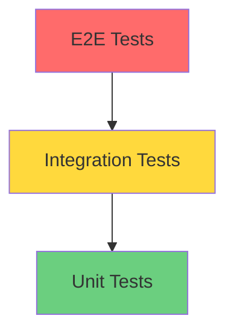

### 13.2 Test Coverage Areas

**Unit Tests:**
- Utility functions
- Data transformations
- State management logic
- API response parsing

**Integration Tests:**
- Component interactions
- API route handlers
- Database operations
- External API mocking

**E2E Tests:**
- User authentication flow
- Video upload and analysis
- Real-time stream recording
- Video library management

**Manual Testing:**
- Webcam permissions
- Different browsers
- Various video formats
- Network conditions
- Mobile responsiveness

---

## 14. Monitoring & Analytics

### 14.1 Monitoring Points

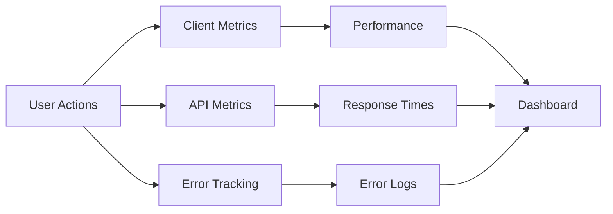

**Key Metrics:**

1. **Performance Metrics**
   - Page load time
   - Time to interactive
   - Frame analysis duration
   - ML model load time

2. **Usage Metrics**
   - Active users
   - Videos analyzed
   - Events detected
   - Dangerous events ratio

3. **Error Metrics**
   - API failures
   - ML model errors
   - Webcam access denials
   - Email delivery failures

4. **Business Metrics**
   - User retention
   - Feature adoption
   - Session duration
   - Videos saved per user

---

## 15. Future Enhancements

### 15.1 Planned Features

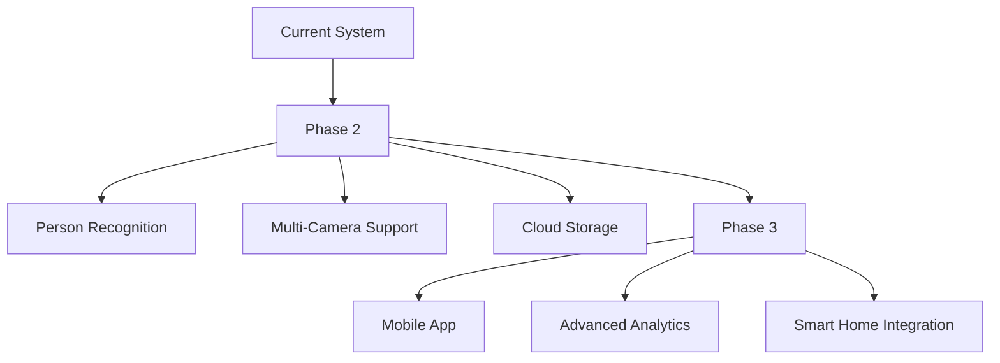

**Phase 2: Enhanced AI**
- Person identification and tracking
- Object detection (weapons, packages)
- Behavioral pattern analysis
- Cross-camera tracking

**Phase 3: Platform Expansion**
- Native mobile apps (iOS, Android)
- Cloud video storage (S3, Cloudflare R2)
- Advanced analytics dashboard
- Smart home integration (Alexa, Google Home)

**Phase 4: Enterprise Features**
- Multi-tenant support
- Role-based access control
- Audit logging
- GDPR compliance tools
- Custom alert rules
- Integration APIs

---

## 16. Technical Debt & Known Issues

### 16.1 Current Limitations

**1. LocalStorage Constraints**
- Limited to ~5-10MB per domain
- Videos stored as blob URLs (temporary)
- No cross-device synchronization

**Solution:** Implement cloud storage (Vercel Blob, S3)

**2. Browser Compatibility**
- Speech recognition only in Chrome/Edge
- WebRTC support varies
- TensorFlow.js performance varies

**Solution:** Feature detection and graceful degradation

**3. API Rate Limits**
- Gemini API: Limited requests per minute
- OpenAI API: Token limits
- Resend API: Email sending limits

**Solution:** Implement request queuing and retry logic

**4. No Real-Time Collaboration**
- Single-user system
- No shared video library
- No team features

**Solution:** Add Supabase real-time subscriptions

### 16.2 Performance Bottlenecks

**1. Frame Analysis Latency**
- Gemini API calls take 1-3 seconds
- Network latency affects real-time feel

**Mitigation:** Show loading indicators, optimize prompts

**2. ML Model Loading**
- Initial load takes 5-10 seconds
- Blocks user interaction

**Mitigation:** Show progress, load in background

**3. Video Processing**
- Large videos take time to analyze
- Browser may freeze during processing

**Mitigation:** Web Workers for background processing

---

## 17. Correctness Properties

### 17.1 Event Detection Properties

**Property 1: Event Timestamp Accuracy**
- **Validates:** Requirements 2.4.2
- **Property:** All detected events must have timestamps in MM:SS format
- **Test Strategy:** Property-based test with random video durations
- **Invariant:** `timestamp.match(/^\d{2}:\d{2}$/) === true`

**Property 2: Dangerous Event Classification**
- **Validates:** Requirements 2.4.1
- **Property:** Events classified as dangerous must trigger email notifications
- **Test Strategy:** Mock dangerous events and verify email API calls
- **Invariant:** `isDangerous === true → emailSent === true`

**Property 3: Frame Analysis Interval**
- **Validates:** Requirements 2.2.2
- **Property:** Frames analyzed at 3-second intervals during recording
- **Test Strategy:** Monitor analysis timestamps
- **Invariant:** `analysisInterval >= 2.9 && analysisInterval <= 3.1`

### 17.2 Video Processing Properties

**Property 4: Video Save Integrity**
- **Validates:** Requirements 2.6.1
- **Property:** Saved videos must include all metadata
- **Test Strategy:** Save video and verify all fields present
- **Invariant:** `savedVideo.id && savedVideo.name && savedVideo.url && savedVideo.timestamps`

**Property 5: LocalStorage Persistence**
- **Validates:** Requirements 3.2.2
- **Property:** Saved videos persist across browser sessions
- **Test Strategy:** Save video, reload page, verify data
- **Invariant:** `localStorage.getItem("savedVideos") !== null`

### 17.3 UI Responsiveness Properties

**Property 6: Real-Time Detection Rendering**
- **Validates:** Requirements 2.2.3
- **Property:** Bounding boxes render within 100ms of detection
- **Test Strategy:** Measure time between detection and canvas update
- **Invariant:** `renderTime < 100ms`

**Property 7: Timeline Synchronization**
- **Validates:** Requirements 2.9.1
- **Property:** Timeline current time matches video playback time
- **Test Strategy:** Compare timeline indicator with video.currentTime
- **Invariant:** `Math.abs(timelineTime - videoTime) < 0.5`

---

## 18. Document History

| Version | Date | Author | Changes |
|---------|------|--------|---------|
| 1.0 | 2026-02-10 | AI Assistant | Initial design document with Mermaid diagrams |

---

**End of Design Document**
